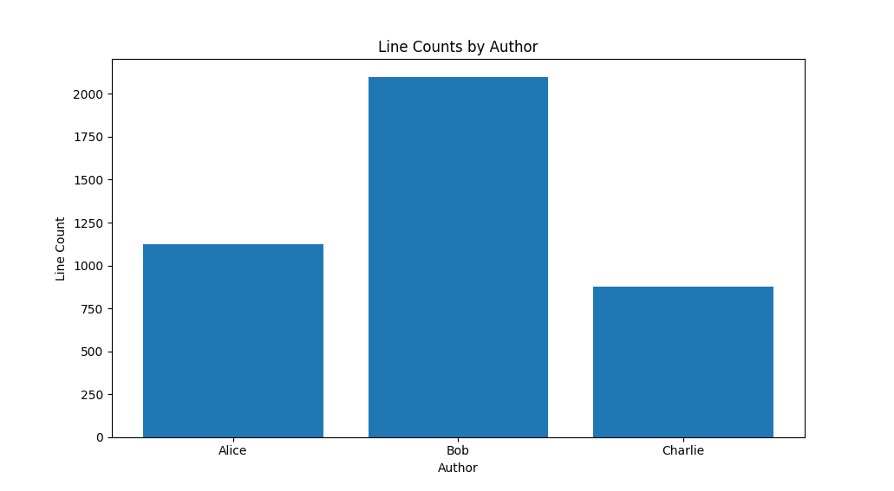

# What's this?
git logをグラフ化するpythonスクリプト。Authorごとのコミット数をグラフ化します。  
A python script that graphs git log. Graph the number of commits by author.


# Get started
```bash
git clone https://github.com/tttol/szayelaporro.git
cd szayelaporro
pip install -r requirements.txt
cd [local git repository path that you want to analyze]
python git-log-by-author.py "2023-11-01" "2023-11-30" "Author Name 1" "Author Name 2" ...
```
> [!NOTE]
> 最後の`git-log-by-author.py`へのパスは各環境で異なるため適宜調整してください。  
> The final path to `git-log-by-author.py` differs in each environment, so please adjust it accordingly.

> [!NOTE]
> szayelaporro=ザエルアポロ  
> 漫画BLEACHのキャラクター。  
> szayelaporro=szayelaporro  
> Characters from the manga BLEACH.
